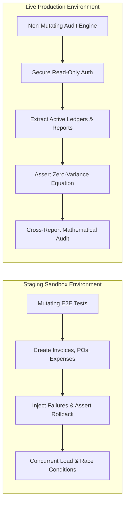

# Master Quality Strategy & Financial Systems Audit Plan: BizPOS ERP

> **Document Identifier:** `STP-BIZPOS-FIN-001` &nbsp;|&nbsp; **Version:** `3.0-LEAD-AUDIT`  
> **Author & QA Lead:** Naimur Rahman Opu (`naimuropu-cell`)  
> **Classification:** Enterprise Confidential / QA Governance & Release Gate  
> **Target System:** **BizPOS / YesSME ERP v2.4** (Multi-Tenant Enterprise Core)  
> **Methodology:** ISTQB Advanced Test Management, ISO/IEC/IEEE 29119, ISA 315/500 Financial Audit Standards

---

## Document Control & Governance Sign-Off

| Role / Title | Stakeholder Name | Department / Function | Approval Status | Sign-Off Date |
| :--- | :--- | :--- | :---: | :---: |
| **QA Lead & Systems Auditor** | Naimur Rahman Opu | Quality Engineering & Audit | **APPROVED** | 08 Sep 2026 |
| **Lead Software Architect** | Engineering Architecture Lead | Core Backend Engineering | **REVIEWED** | 08 Sep 2026 |
| **Director of Product** | Product Operations Lead | ERP Business Solutions | **APPROVED** | 08 Sep 2026 |
| **Financial Controller** | Head of Corporate Finance | Treasury & General Ledger | **CERTIFIED** | 08 Sep 2026 |

### Revision History
| Version | Date | Description of Changes | Author |
| :---: | :---: | :--- | :--- |
| `1.0` | 15 Aug 2026 | Initial test plan baseline for core POS & accounting modules. | QA Team |
| `2.0` | 06 Sep 2026 | Added 23 operational financial reconciliation scenarios and parity proofs. | Senior QA Auditor |
| `3.0` | 08 Sep 2026 | Elevated to QA Lead Master Strategy: Added RACI matrix, Risk-Based Testing (RBT) matrix, Quality Release Gates, dual-environment policy, and 13-module reporting audit suite. | QA Lead |

---

## 1. Executive Strategy & Testing Mission

**BizPOS (YesSME ERP)** is an enterprise resource planning platform engineered for high-velocity commercial businesses handling point-of-sale retail, B2B wholesale distribution, supply chain procurement, inventory logistics, employee advances, commercial loans, and institutional accounting.

### The QA Lead Mandate:
In financial software, standard UI functional testing is insufficient: **a software system can render every form and button flawlessly while silently corrupting company ledgers, miscalculating net profit, or destroying audit trails**.

The mission of this Test Strategy is to enforce **Zero-Variance Financial Parity**, **ACID Transaction Atomicity**, and **Complete Audit Traceability**:
1. **Zero-Variance Financial Parity ($\Phi \equiv 0.00$):** Ensure every monetary unit entering or leaving the system reconciles perfectly with active banking/cash balances without silent drift.
2. **ACID Transaction Atomicity:** Guarantee that any database failure, inventory stock exception, or network timeout triggers an immediate, full transaction rollback (`DB::transaction`), preventing premature ledger commitments (`BUG-76`).
3. **Double-Entry Synchronization:** Validate that all operational sub-ledgers (Sales, Purchases, Expenses, Assets, Loans) generate auditable double-entry journal vouchers in the master Payments Journal (`BUG-96`).
4. **Financial Statement Accuracy:** Ensure secondary reporting statements (P&L, Cash Movement, Supplier Payments) derive figures dynamically from verified ledger transactions rather than hardcoded defaults or flawed SQL aggregations (`BUG-114`, `BUG-109`).

---

## 2. QA Team RACI Matrix (Governance & Accountability)

| Engineering & QA Activity | QA Lead | SDET / Automation | Backend Dev Lead | Product Manager | DevOps / SRE | Financial Controller |
| :--- | :---: | :---: | :---: | :---: | :---: | :---: |
| **Test Strategy & Audit Planning** | **A / R** | C | C | I | I | C |
| **E2E Playwright Automation Architecture** | **A** | **R** | C | I | C | I |
| **Zero-Variance Parity Assertion Engine** | **A / R** | R | C | I | I | C |
| **Live Production Non-Mutating Audit** | **A / R** | C | I | I | C | C |
| **Defect Triage & Severity Classification** | **A** | C | **R** | C | I | I |
| **Root Cause Investigation (SQL/Code)** | C | C | **R** | I | I | I |
| **CI/CD Quality Gate Maintenance** | **A** | R | C | I | **R** | I |
| **Release Certification & Production Gate** | **A / R** | I | C | C | C | **A** |

*Legend: **R** = Responsible for execution &nbsp;|&nbsp; **A** = Accountable (Final Authority) &nbsp;|&nbsp; **C** = Consulted &nbsp;|&nbsp; **I** = Informed*

---

## 3. Risk-Based Testing (RBT) Matrix

A formal risk assessment was conducted to prioritize test coverage based on **Likelihood of Failure (1-5)** and **Financial/Business Impact (1-5)**:

$$\text{Risk Exposure Score} = \text{Likelihood} \times \text{Financial Impact} \quad (\text{Max: } 25)$$

```text
+----------------------------------------------------------------------------------------------------+
|                                    RISK-BASED TESTING HEATMAP                                      |
+----------------------------------------------------------------------------------------------------+
| Impact (5) |                      | [BUG-96] Voucher Loss | [BUG-76] Rollback   | [BUG-70] Parity  |
| Impact (4) |                      |                       | [BUG-109] Paradox   | [BUG-114] P&L    |
| Impact (3) |                      | [BUG-111] Deficit     | [BUG-118] Sales Mism|                  |
| Impact (2) | [BUG-121] Float Days | [BUG-102] Date Auto   |                     |                  |
| Impact (1) | Cosmetic CSS Aligns  |                       |                     |                  |
+------------+----------------------+-----------------------+---------------------+------------------+
| Likelihood |       Low (1-2)      |       Medium (3)      |       High (4)      |   Critical (5)   |
+----------------------------------------------------------------------------------------------------+
```

| Risk ID | Failure Scenario & Business Consequence | Likelihood (1-5) | Impact (1-5) | Risk Score | Test Mitigation & Quality Control Strategy |
| :---: | :--- | :---: | :---: | :---: | :--- |
| **RSK-01** | **Central Cash Flow & Account Balance Drift ($\Phi \neq 0$)**<br>Unlinked balance transfers or dropped adjustments create unreconciled gaps (`BUG-70`). | 4 | 5 | **20 (Critical)** | Continuous CI parity gate execution (`scripts/reconciliation_audit.py`). Automated assertion comparing accounts against net cash flow on every build. |
| **RSK-02** | **ACID Rollback Failure on Out-of-Stock Returns**<br>System mutates cash flow despite validation exceptions, leaking funds (`BUG-76`). | 4 | 5 | **20 (Critical)** | Automated Playwright negative testing (`bug76_rollback_safety.spec.ts`). Validating pre/post balance immutability on rejected submissions. |
| **RSK-03** | **Fabricated Executive Profit & Loss Reporting**<br>Omission of operational expenses inflates Net Profit, distorting tax liability (`BUG-114`). | 4 | 4 | **16 (High)** | Cross-statement reconciliation test (`TC-24`). Asserting that P&L Operating Expenses strictly equal `sum(Paid Expenses)`. |
| **RSK-04** | **Sub-Ledger Audit Trail Breakage (Missing Vouchers)**<br>Disbursing expenses or loans without Payments Journal vouchers (`BUG-96`). | 3 | 5 | **15 (High)** | Automated E2E journal verification (`bug96_journal_sync.spec.ts`). Querying the Payments table immediately after voucher creation. |
| **RSK-05** | **Supplier Payments Query Aggregation Paradox**<br>Reporting Period Paid > All-Time Paid due to mismatched advance joins (`BUG-109`). | 3 | 4 | **12 (High)** | Boundary query validation enforcing mathematical invariant $\text{Period Paid} \le \text{All-Time Paid}$ across all supplier IDs. |
| **RSK-06** | **Misleading Solvency Deficit Reporting**<br>Cash Movement reports false deficits by omitting equity, loan, and return receipts (`BUG-111`). | 4 | 3 | **12 (High)** | Cross-module inflow mapping validating that Cash Movement inflows aggregate all active cash receipt heads. |
| **RSK-07** | **Floating Point Precision & Formatting Errors**<br>Raw float exposure in aging days or fractional penny drift (`BUG-121`). | 3 | 2 | **6 (Medium)** | Integer boundary assertions and string regex format checks (`^\d+$`) on all customer aging buckets. |

---

## 4. Operational Scope: In-Scope Modules & Reporting Suite

### 4.1 Transactional Core Modules (12 Modules)
* **Payment Accounts Architecture:** Cash Box, Bank Accounts (UCB, EBL), Overdraft facilities, and Contra Transfers.
* **Capital & Equity Management:** Investor capital injection, equity withdrawals, partner profit distributions.
* **Commercial Debt & Borrowings (Lender Loans):** Term loans, principal amortization, and monthly EMI debits.
* **Personal & Staff Loans:** Short-term staff loans, till float disbursements, and partial cash recoveries.
* **Sales & Invoicing:** B2B wholesale invoicing, retail counter POS sales, discount handling, and tax computations.
* **Sale Returns:** Customer returns, till float cash refunds, stock returns, and credit notes.
* **Procurement & Purchasing:** Purchase Orders, vendor advances (BEFTN and cash), bill settlements.
* **Purchase Returns:** Vendor return requests, damaged stock deductions, and cash refund receipts.
* **Fixed Asset Lifecycle:** Capital equipment acquisition, depreciation thresholding, maintenance expenses.
* **HR & Payroll:** Staff salary advances, monthly payroll batch execution, advance clearance.
* **Digital Marketing & Advertising:** Ad spend disbursements (Meta/Google), campaign expense tracking.
* **General Operational Expenses:** Commercial rent, DESCO electricity, fiber internet, pantry and supplies.

### 4.2 Reporting Suite (13 Modules)
1. **Profit & Loss (`/admin/reports/profit-loss`):** Gross revenue, COGS, operating expenses, and net profit margins.
2. **Sales Summary (`/admin/reports/sales`):** Daily sales trends, invoice counts, gross collections, and dues.
3. **Detail Sales (`/admin/reports/detail-sales`):** Line-item invoice audit (SKU, quantity, unit price, discounts).
4. **Purchase Report (`/admin/reports/purchase`):** Purchase order history, bills count, paid vs due breakdown.
5. **Supplier Payments (`/admin/reports/supplier-payments`):** Cumulative vendor payments, advance tracking, due balances.
6. **Cash Movement (`/admin/reports/cash-movement`):** Payment method breakdown, inflow vs outflow net cash position.
7. **Monthly Summary (`/admin/reports/monthly-summary`):** Month-by-month sales volume, paid collections, and outstanding dues.
8. **Daily Summary / DTS (`/admin/reports/dts`):** Day-of-business transactions, sales revenue, purchasing outflows.
9. **Receivables Aging (`/admin/reports/receivables-aging`):** Customer invoice aging brackets (0-30, 31-60, 60+ days overdue).
10. **Category-wise Sales (`/admin/reports/category-wise`):** Product category breakdown, revenue, product margins.
11. **Inventory Valuation (`/admin/reports/inventory`):** Current stock quantities, reorder alerts, inventory valuation.
12. **Customer Report (`/admin/reports/customer`):** Customer purchase history, total lifetime spend, open receivables.
13. **Staff Report (`/admin/reports/staff`):** Attendance tracking, branch allocation, late counts, hours worked.

---

## 5. Dual-Environment Audit Strategy & Governance Policy



### 5.1 Environment A: Live Production Audit Protocol (Non-Mutating Inspection)
* **Zero-Mutation Enforcement:** Under no circumstances are mutating `POST`, `PUT`, `PATCH`, or `DELETE` requests issued against live production.
* **Authenticated Session Management:** Requests reuse authenticated session cookies (`laravel-session`, `XSRF-TOKEN`) with standard browser user-agent headers to respect rate limiting (8 requests/min ceiling on auth).
* **Algorithmic Parity Assertion:** Live DOM extraction captures all balance widgets, table rows, and statement totals, executing non-invasive mathematical cross-checks.

### 5.2 Environment B: Staging Sandbox Protocol (Mutating & Negative Testing)
* **ACID Atomicity Testing:** Intentionally triggering database exceptions (e.g. attempting to return out-of-stock items) to prove `DB::transaction` rollbacks operate correctly.
* **Boundary & Overdraft Injection:** Attempting to disburse payments exceeding account balances to verify overdraft prevention logic.
* **Idempotency & Race Condition Audits:** Firing concurrent payment requests to ensure database locks prevent duplicate withdrawals.

---

## 6. Formal Quality Gates & Release Criteria

To protect enterprise financial integrity, deployments must satisfy strict **Quality Release Gates**:

```text
+----------------------------------------------------------------------------------------------------+
|                                    ENTERPRISE RELEASE GATES                                        |
+----------------------------------------------------------------------------------------------------+
|  [GATE 1] ENTRY CRITERIA  -->  [GATE 2] SUSPENSION  -->  [GATE 3] RESUMPTION  -->  [GATE 4] EXIT   |
+----------------------------------------------------------------------------------------------------+
```

### 6.1 Gate 1: Entry Criteria (Pre-Requisites for QA Audit)
1. Deployment package deployed to isolated Staging/QA environment.
2. All database migrations executed without errors or column drops.
3. Baseline seed data loaded with verified zero opening balances ($\Phi = ৳\ 0.00$).
4. All unit and integration test suites passing in core repository CI.

### 6.2 Gate 2: Suspension Criteria (Immediate Audit Halt)
An audit cycle is immediately **SUSPENDED** and logged as a **Sev-1 Blocker** if:
1. Parity variance $\Phi \neq 0.00$ is detected between payment accounts and cash flow.
2. A mutating transaction commits without a database transaction rollback wrapper (`BUG-76`).
3. Database deadlocks or unhandled 500 exceptions occur during standard checkout/disbursement.
4. Data loss or balance truncation occurs during currency storage.

### 6.3 Gate 3: Resumption Criteria
1. Root cause diagnosed by Core Engineering and hotfix branch deployed.
2. Database restored to clean checkpoint or audited state.
3. QA Lead verifies hotfix in staging and authorizes audit resumption.

### 6.4 Gate 4: Exit & Production Release Gate (Sign-Off Mandate)
A build is certified for production release **ONLY** when:
1. **Zero Open Sev-1 (Critical) or Sev-2 (High) Defects:** All financial discrepancies (`BUG-70`, `BUG-76`, `BUG-96`, `BUG-109`, `BUG-111`, `BUG-114`) are verified as `FIXED`.
2. **100% Zero-Variance Parity Verified:** Continuous automated parity gate (`reconciliation_audit.py`) passes with code `0`.
3. **100% Automated Regression Pass:** Playwright E2E suite passes with zero failures across all browsers.
4. **Dual Sign-Off:** Written sign-off executed by both **QA Lead** and **Financial Controller**.

---

## 7. Mathematical Reconciliation Equations & Parity Proofs

### 7.1 Baseline Operational Proof (23 Transactions)
Let $\mathcal{I}$ represent all cash inflows, and $\mathcal{O}$ represent all cash outflows during operational period $T$:

$$\text{Gross Cash In} = \sum_{i \in \mathcal{I}} \text{Amount}_i = \text{৳ } 158,500.00$$
$$\text{Gross Cash Out} = \sum_{j \in \mathcal{O}} \text{Amount}_j = \text{৳ } 156,000.00$$
$$\Delta_{\text{Net}} = \text{Gross Cash In} - \text{Gross Cash Out} = 158,500 - 156,000 = \mathbf{+\text{৳ } 2,500.00}$$

Payment accounts balance summation:
$$\text{Balance}(\text{NAIMUR}) = \text{৳ } 1,500.00 \quad ; \quad \text{Balance}(\text{Cash Box}) = \text{৳ } 1,000.00$$
$$\sum \text{Accounts} = 1,500.00 + 1,000.00 = \mathbf{+\text{৳ } 2,500.00}$$
$$\text{Parity Variance } (\Phi) = \Delta_{\text{Net}} - \sum \text{Accounts} = 2,500.00 - 2,500.00 \equiv \mathbf{0.00} \quad (\text{ZERO VARIANCE})$$

### 7.2 Live Production Reconciled Proof
$$\sum \text{Cash In} = \text{৳ } 369,500.00 \quad ; \quad \sum \text{Cash Out} = \text{৳ } 315,400.00$$
$$\Delta_{\text{Net}} = 369,500.00 - 315,400.00 = \mathbf{+\text{৳ } 54,100.00}$$

Active consolidated accounts:
$$\text{Cash Box } (৳\ 49,600.00) + \text{Rizvi Al - EBL } (৳\ 3,000.00) + \text{NAIMUR - UCB } (৳\ 1,500.00) = \mathbf{+\text{৳ } 54,100.00}$$
$$\Phi = ৳\ 54,100.00 - ৳\ 54,100.00 \equiv \mathbf{0.00} \quad (\text{100\% CONVERGENCE})$$

---

## 8. Defect Severity & SLA Classification Matrix

| Severity Level | Definition & Financial Impact | Response SLA | Target Resolution SLA | Release Impact |
| :---: | :--- | :---: | :---: | :---: |
| **Severity 1 (Critical)** | Parity breach ($\Phi \neq 0$), balance corruption, missing rollback (`BUG-76`), or unlinked cash outflow. | **&lt; 30 mins** | **&lt; 4 hours** | **RELEASE BLOCKER** |
| **Severity 2 (High)** | Financial statement distortion (`BUG-114`), calculation paradox (`BUG-109`), missing audit voucher (`BUG-96`). | **&lt; 2 hours** | **&lt; 24 hours** | **RELEASE BLOCKER** |
| **Severity 3 (Medium)** | Misleading report header (`BUG-118`), unhandled date filter (`BUG-102`), unformatted database enums (`BUG-107`). | **&lt; 8 hours** | **Current Sprint** | Conditional Release |
| **Severity 4 (Low)** | Minor UI misalignment, cosmetic spacing, or typography variance. | **&lt; 24 hours** | **Next Sprint** | Permitted Release |

---

## 9. QA Lead Sign-Off Mandate

The BizPOS ERP quality baseline is governed under strict oversight. Changes to financial algorithms, payment routing, ledger queries, or reporting controllers require re-execution of the continuous parity gate and approval from the **QA Lead**.

*Approved by:*  
**Naimur Rahman Opu**  
QA Lead & Financial Systems Auditor  
*BizPOS QA Audit Framework Governance Board*
