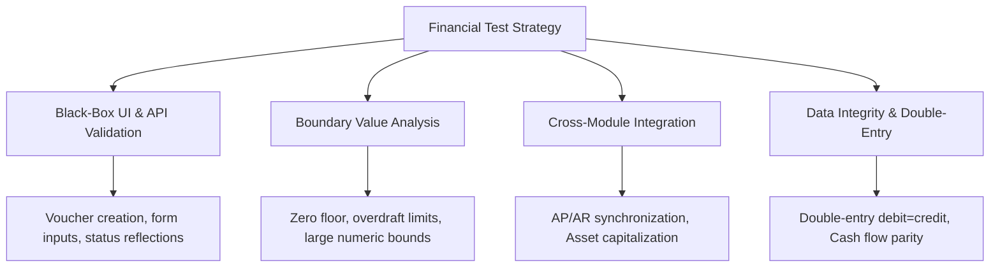

# Master Financial Systems Test Plan: BizPOS / YesSME ERP

| Document Identifier | STP-BIZPOS-FIN-001 | Version | 2.4-AUDIT |
| :--- | :--- | :--- | :--- |
| **Target Application** | BizPOS / YesSME Enterprise Suite | **Audit Scope** | Multi-Module Financial Accounting & Parity |
| **Author** | Senior QA & Financial Systems Auditor | **Status** | Approved / Active Baseline |
| **Effective Date** | Q3 / Operational Audit Baseline | **Classification** | Enterprise Confidential / QA Internal |

---

## 1. Introduction & Executive Objectives

BizPOS (YesSME ERP) is a comprehensive enterprise resource planning system tailored for high-velocity commercial businesses handling point-of-sale retail, B2B wholesale distribution, procurement, inventory logistics, employee advances, commercial loans, and institutional accounting.

The primary objective of this **Financial Systems Test Plan** is to validate that:
1. Every business event causing a monetary debit or credit maintains strict **atomic transaction integrity** (ACID compliance).
2. The system adheres to the **Zero-Variance Financial Parity Principle**: no funds enter or exit the active payment accounts without an equal and opposite entry in the ledger accounts.
3. Sub-ledger transactions (such as counter sales, employee advances, vendor pre-payments, and bank charges) synchronize seamlessly with the General Journal, Cash Flow Statements, and Physical Account Registers.

---

## 2. In-Scope vs. Out-of-Scope Modules

### 2.1 In-Scope Modules
* **Payment Account Ledger Architecture:**
  * Bank Account: `'NAIMUR'` (United Commercial Bank - UCB Corporate Account).
  * Cash Account: `'Cash Box'` (Counter cash till & main office liquidity box).
* **Capital & Equity Management:** Initial capital injection, equity injections, partner drawings/withdrawals.
* **Commercial Debt & Borrowings (Lender Loans):** Term loan disbursement, interest accounting, monthly installment (EMI) amortized debit.
* **Sales & Invoicing:** Direct wholesale bank wire receipt, counter POS cash collection, invoice settlement.
* **Supply Chain & Purchasing:** Vendor advances (BEFTN bank wire and counter cash), invoice pre-payments, operational consumables.
* **Fixed Asset Lifecycle:** Hardware/equipment acquisition capitalization, ongoing asset repair & maintenance expense.
* **Human Resources & Payroll:** Short-term staff emergency salary advances, advance recovery via counter cash.
* **Personal & Director Advances:** Personal loan disbursement, counter-cash partial recovery.
* **Digital Marketing & Advertising:** Meta/Facebook ad campaign automated card spend and invoice settlement.
* **General Operational Expenses:** Commercial facility lease/rent, utility provider payments (electricity), communication/ISP broadband, pantry/refreshments.
* **Banking & Treasury:** Automated service charges, SMS alert levies, ledger maintenance charges, and inter-account contra transfers (Bank to Cash Box).

### 2.2 Out-of-Scope (Deferred to Phase II)
* Foreign exchange multi-currency revaluation gains/losses.
* Year-end automated asset depreciation schedules (Straight-line / WDV).
* Automated corporate taxation (VAT/AIT) annual withholding return filing.

---

## 3. Auditing Assumptions & Operational Constraints

1. **Pre-Audit Baseline Zero State:** Prior to initiating Transaction TC-01, both `'NAIMUR'` (Bank) and `'Cash Box'` (Cash) held a verified balance of ৳ 0.00.
2. **Single Currency:** All transactions are denominated in Bangladeshi Taka (BDT / ৳).
3. **Account Atomicity:** A transaction affecting an account must debit/credit the exact designated account simultaneously with the corresponding expense, asset, or liability head.
4. **Immutability of Historical Journals:** Once committed, transaction vouchers cannot be modified without an explicit reversal or credit note.

---

## 4. Test Types & Verification Methodologies

### 4.1 Black-Box Functional Validation
* **Form & Transaction Validation:** Verify that payment method selection (`Bank` vs `Cash Box`) routes debits and credits to the exact database account record.
* **Receipts & Payment Journals:** Validate that every creation of a receipt or payment voucher generates a printable, sequential, un-duplicated voucher ID.
* **UI Real-Time Updates:** Verify that executing a transaction immediately reflects on the dashboard payment widget and cash-in-hand summary without requiring browser cache flushing.

### 4.2 Boundary Value Analysis (BVA) & Negative Testing
* **Negative Account Balances (Overdraft Prevention):**
  * *Test Condition:* Attempting to disburse ৳ 50,000 from `Cash Box` when the available balance is ৳ 10,000.
  * *Expected Behavior:* System must reject transaction with validation error: `"Insufficient funds in account: Cash Box"`.
* **Zero Value Transactions:** Ensure inputs of ৳ 0.00 are rejected for payment/receipt vouchers.
* **Floating Point Precision & Decimal Rounding:** Ensure currency calculations do not truncate or introduce floating-point drift (e.g. standard IEEE 754 precision issues). All figures stored as fixed-point integers or decimals (2 decimal places).

### 4.3 Cross-Module Integration Testing
* **Purchasing $\leftrightarrow$ Accounts Payable $\leftrightarrow$ Bank Ledger:**
  * When an advance payment of ৳ 30,000 is made to a packaging supplier via BEFTN, the system must:
    1. Deduct ৳ 30,000 from Bank Account (`NAIMUR`).
    2. Post a Debit to Vendor Advance Ledger (Current Asset).
    3. Update Supplier Ledger balance as a pre-payment credit against future POs.
* **HR Advance $\leftrightarrow$ Payroll Ledger:**
  * Salary advances given in cash must register against the specific employee profile, be available for deduction in the monthly payroll batch, and reflect in the counter cash statement.

### 4.4 Data Integrity & Double-Entry Accounting Invariance
* **Double-Entry Equilibrium:** For every operational event:
  $$\sum \text{Debits} \equiv \sum \text{Credits}$$
* **Idempotency & Concurrency:** Repetitive clicks on submission buttons (double click on "Confirm Payment") must be protected via unique client idempotency tokens, preventing accidental duplicate debits.

---

## 5. Reconciliation Equation & Mathematical Proof

The core audit criteria enforces **Zero-Variance Financial Parity**. 

### 5.1 Formal Parity Equation
Let $\mathcal{I}$ represent the set of all cash inflow transactions, and $\mathcal{O}$ represent the set of all cash outflow transactions during the audit period $T$.

$$\text{Gross Cash In} = \sum_{i \in \mathcal{I}} \text{Amount}_i = \text{৳ } 158,500.00$$

$$\text{Gross Cash Out} = \sum_{j \in \mathcal{O}} \text{Amount}_j = \text{৳ } 156,000.00$$

The Net System Operational Balance ($\Delta_{\text{Net}}$) is defined as:
$$\Delta_{\text{Net}} = \text{Gross Cash In} - \text{Gross Cash Out} = 158,500 - 156,000 = \mathbf{+\text{৳ } 2,500.00}$$

### 5.2 Payment Account Balance Summation
Let $\mathcal{A} = \{\text{NAIMUR}, \text{Cash Box}\}$ be the set of all active payment accounts.

$$\text{Balance}(\text{NAIMUR}) = \text{৳ } 1,500.00$$
$$\text{Balance}(\text{Cash Box}) = \text{৳ } 1,000.00$$

$$\sum_{a \in \mathcal{A}} \text{Balance}(a) = 1,500.00 + 1,000.00 = \mathbf{+\text{৳ } 2,500.00}$$

### 5.3 Audit Reconciliation Parity Rule
$$\text{Parity Variance} (\Phi) = \Delta_{\text{Net}} - \sum_{a \in \mathcal{A}} \text{Balance}(a)$$
$$\Phi = 2,500.00 - 2,500.00 = \mathbf{0.00}$$

> **Audit Threshold:** $\Phi$ must strictly equal $0.00$. Any value $\Phi \neq 0.00$ triggers an immediate Sev-1 Audit Block and system halts for monetary drift investigation.

### 5.4 Treatment of Inter-Account Contra Transfers
* An internal fund transfer between active accounts (e.g. TC-08: Transfer ৳ 15,000 from `NAIMUR` to `Cash Box`) is classified as a **Contra Journal Entry**.
* It reduces `NAIMUR` by ৳ 15,000 and increments `Cash Box` by ৳ 15,000.
* Net effect on $\sum \text{Active Payment Accounts}$:
  $$\Delta \text{Accounts} = (-15,000) + (+15,000) = \text{৳ } 0.00$$
* It does not alter net enterprise equity or external cash flow, preserving total parity without double counting.

---

## 6. Daily Close-of-Business (COB) Verification Procedure

To verify financial integrity, the auditor executes the following 5-step reconciliation protocol:

1. **Step 1: Extract Cash Flow Statement:** Run the system Cash Flow report for the audit window; record Total Cash In and Total Cash Out.
2. **Step 2: Calculate Expected Net:** Compute $\text{Expected Net} = \text{Total Cash In} - \text{Total Cash Out}$.
3. **Step 3: Extract Active Account Balances:** Query the `payment_accounts` table or UI overview for `NAIMUR` and `Cash Box`.
4. **Step 4: Execute Parity Comparison:** Check if $\text{Account Sum} == \text{Expected Net}$.
5. **Step 5: Sub-Ledger to General Journal Cross-Check:** Sample each sub-ledger transaction (Expenses, Asset Procurements, Supplier Payments) and verify that an identical entry exists in the master `Finance -> Payments Journal`.
   *(Note: This step directly revealed defect `BUG-96`).*

---

## 7. Pass/Fail Criteria & Sign-Off Mandate

| Test Result | Criteria | Action / Status |
| :--- | :--- | :--- |
| **PASS** | $\Phi = 0.00$, all sub-ledger transactions reflect in Payments Journal with zero missing vouchers. | Release certified for production accounting. |
| **CONDITIONAL PASS** | $\Phi = 0.00$, but non-critical UI formatting bugs or reporting delays present. | Release permitted with hotfix tracking. |
| **AUDIT FAIL (Current State)** | $\Phi = 0.00$, BUT sub-ledger audit trail breakage detected (`BUG-96`: Missing Payments Journal vouchers). | Release blocked from statutory compliance certification until voucher sync hook is remediated. |

---

## 8. Defect Severity Matrix

* **Severity 1 (Critical):** Parity variance $\Phi \neq 0.00$, silent balance alteration, or transaction data corruption.
* **Severity 2 (High - Current `BUG-96`):** Double-entry journal voucher missing despite cash flow and balance deduction, breaking external audit trail.
* **Severity 3 (Medium):** Incorrect report labeling, non-critical filter failure in ledger search, or slow voucher generation.
* **Severity 4 (Low):** Minor UI cosmetic misalignments or typography inconsistencies.
