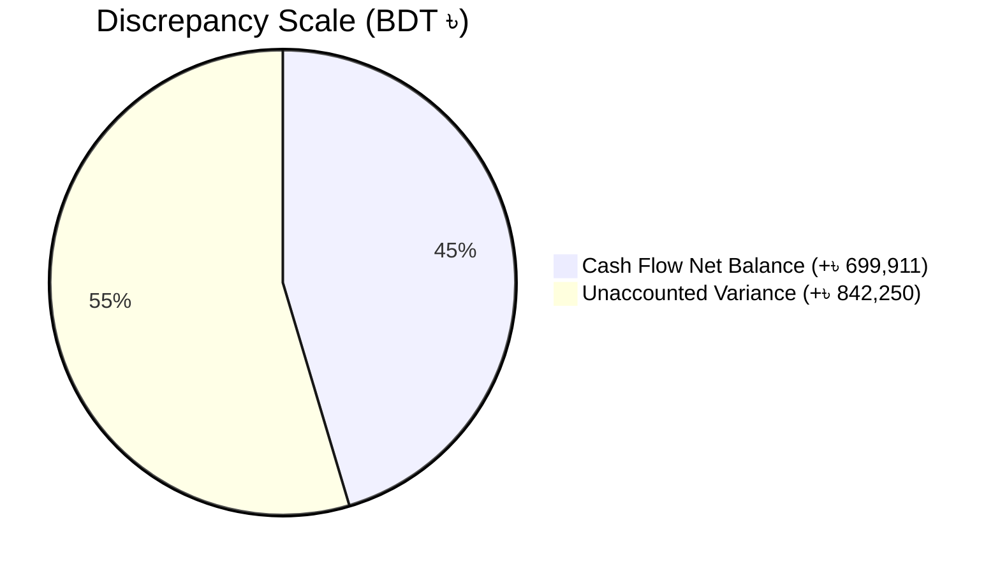
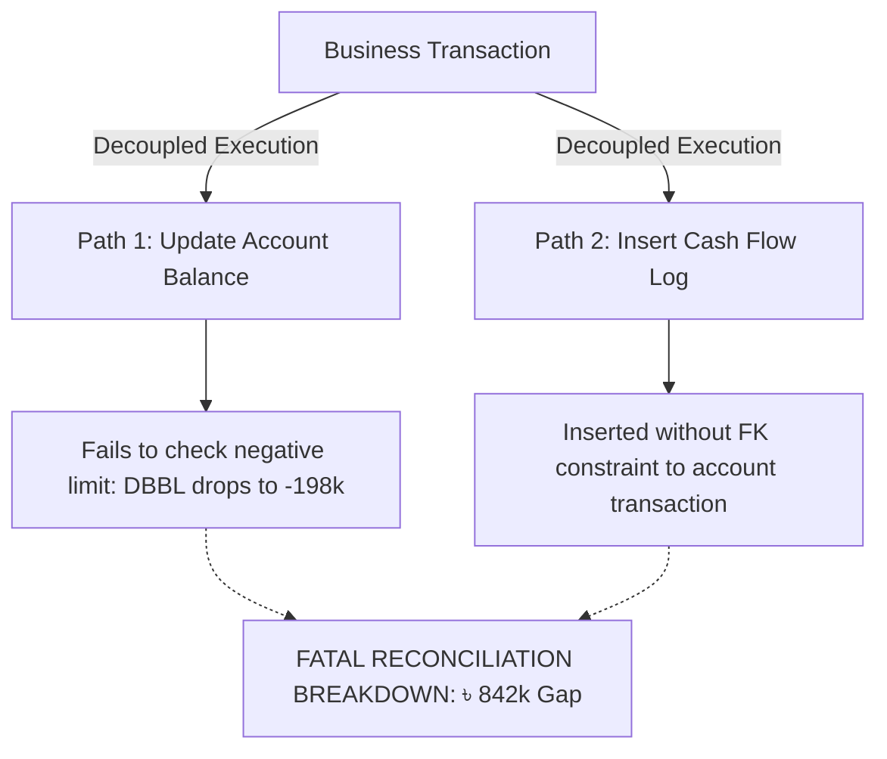

# Defect Report: BUG-70

| Attribute | Specification |
| :--- | :--- |
| **Defect Identifier** | **BUG-70** |
| **Defect Title** | Severe financial discrepancy: Sum of all Payment Account balances does not match Cash Flow Net Balance (Difference: ৳ 842,249.98) |
| **Module / Sub-system** | `Manage Accounts` $\to$ `Payment Accounts & Cash Flow Reconciliation` |
| **Severity** | **Critical (Severity 1)** |
| **Priority** | **Critical (Priority 0)** |
| **Defect Type** | Financial Invariant Violation / Double-Entry Ledger Decoupling |
| **Discovered By** | Senior QA & Financial Systems Auditor |
| **Target Build / Env** | BizPOS / YesSME ERP v2.4 (Enterprise Core) |
| **Current Status** | **NEED REVISIONS - QA (REOPENED AUDIT)** |

---

## 1. Executive Summary & Defect Narrative

During system-wide financial integrity testing on the BizPOS / YesSME ERP staging platform, an extreme **Ledger Reconciliation Breakdown** was discovered between the active **Payment Accounts** balances and the central **Cash Flow Statement**.

In double-entry financial architecture, the fundamental liquidity equation states:
$$\text{Net Balance}(\text{Cash Flow}) \equiv \sum_{i=1}^{n} \text{Active Account Balance}_i$$

However, when cross-reconciling all active accounts against the Cash Flow statement:
* Consolidated Payment Account balances totaled: **৳ -142,339.09** (Negative ৳ 142k).
* Central Cash Flow Net Balance reported: **৳ +699,910.89** (Positive ৳ 700k).
* **Unreconciled Liquidity Gap ($\Delta_{\text{Error}}$):** **৳ 842,249.98**

This represents an irreconcilable audit failure indicating that payment account balance mutations and cash flow line-item logging operate on decoupled, non-atomic database procedures.

---

## 2. Reconciliation Forensic Evidence

### 2.1 Active Payment Accounts Breakdown (`Manage Accounts -> Balance Transfers`)
Extracting account balances directly from the transfer and ledger interface revealed severe anomalies, including an unconstrained negative bank balance:

| Account Identifier | Institution / Account Type | Audited Balance (BDT / ৳) | Ledger State / Observation |
| :--- | :--- | :---: | :--- |
| `ACC-CASH-01` | Cash Account (`Cash Box`) | +৳ 46,060.91 | Liquid Counter Till Float |
| `ACC-BANK-01` | Dutch-Bangla Bank Ltd (`DBBL`) | **-৳ 198,500.00** | **Unchecked Negative Overdraft Drift** |
| `ACC-MFS-01` | Mobile Banking (`bKash / Nagad`) | +৳ 100.00 | Digital Wallet Reserve |
| `ACC-BANK-02` | Eastern Bank Ltd (`EBL`) | +৳ 10,000.00 | Corporate Current Account |
| **Consolidated Sum** | **All Active Payment Accounts** | **-৳ 142,339.09** | **Gross Negative Liquidity** |

### 2.2 Cash Flow Statement (`Manage Accounts -> Cash Flow`)
The central Cash Flow statement over the lifetime audit horizon reported:

| Cash Flow Dimension | Reported Aggregate (BDT / ৳) |
| :--- | :---: |
| **All-Time Cash In** | **৳ 4,772,165.00** |
| **All-Time Cash Out** | **৳ 4,072,254.11** |
| **Reported Net Balance** | **+৳ 699,910.89** |

### 2.3 Mathematical Discrepancy Computation
$$\Delta_{\text{Variance}} = \text{Cash Flow Net Balance} - \sum \text{Payment Accounts}$$
$$\Delta_{\text{Variance}} = 699,910.89 - (-142,339.09) = \mathbf{৳\ 842,249.98}$$



---

## 3. Preconditions & Environment

1. Target System: BizPOS / YesSME ERP v2.4.
2. User Role: `Super Admin / Financial Auditor`.
3. Multiple payment accounts active: `Cash Box`, `DBBL`, `EBL`, `Mobile Banking`.
4. Operational history: 4.77M Inflows, 4.07M Outflows processed across POS, Purchasing, Payroll, and Expenses.

---

## 4. Step-by-Step Reproduction Procedure

1. Log in as Administrator to the BizPOS / YesSME ERP portal.
2. Navigate via sidebar to **Manage Accounts** $\to$ **Balance Transfers**.
3. Open the **From Account** dropdown list and document the displayed balances for all accounts:
   * `Cash`: ৳ 46,060.91
   * `DBBL`: ৳ -198,500.00
   * `Mobile Banking`: ৳ 100.00
   * `EBL`: ৳ 10,000.00
   * *Compute Sum:* $46,060.91 - 198,500.00 + 100.00 + 10,000.00 = \mathbf{-৳\ 142,339.09}$.
4. Navigate via sidebar to **Manage Accounts** $\to$ **Cash Flow**.
5. Observe the aggregate cards:
   * `Cash In`: ৳ 4,772,165.00
   * `Cash Out`: ৳ 4,072,254.11
   * `Net Balance`: ৳ 699,910.89.
6. Compare the active account sum ($-৳\ 142,339.09$) with the Cash Flow Net Balance ($+৳\ 699,910.89$).
7. **Observe the catastrophic mismatch of ৳ 842,249.98.**

---

## 5. Financial Audit & Statutory Compliance Impact

1. **Trial Balance & Balance Sheet Falsification:**
   The statutory Balance Sheet utilizes the cash & bank account balances (`-৳ 142,339.09`), while the Income Statement and Cash Flow reports indicate a healthy liquid surplus of `+৳ 699,910.89`. No chartered accounting firm can sign off on these financial statements without issuing a **Disclaimer of Opinion** or an **Adverse Audit Opinion** under ISA 705.
2. **Silent Negative Overdraft Exploits:**
   The Dutch-Bangla Bank Ltd account (`DBBL`) dropped to **-৳ 198,500.00** without triggering system validation, showing that payments/disbursements are processed without verifying liquid sufficiency.
3. **Ghost Inflows & Unlinked Deductions:**
   The existence of an ৳ 842k positive delta in Cash Flow indicates that either:
   * Significant cash-in receipts were logged in Cash Flow without debiting any active account, OR
   * Massive bank disbursements were executed directly against bank accounts without logging corresponding expense line-items in Cash Flow.

---

## 6. Technical Root Cause Analysis



1. **Decoupled Architecture (No Single Source of Truth):**
   * Account balances are maintained as mutable columns (`balance` in `accounts` table), while Cash Flow is aggregated dynamically from `cash_flow_entries`.
   * When transactions are deleted, voided, or fail halfway, one table is mutated while the other remains unchanged.
2. **Missing Database Integrity Invariants:**
   * No `CHECK (balance >= 0)` constraint exists on corporate bank and cash accounts (unless explicitly flagged as an approved credit/OD facility).
3. **Absence of Idempotent Event Orchestrator:**
   * Financial mutations do not pass through a centralized double-entry accounting ledger engine. Sub-modules (Purchasing, HR, Sales) write raw queries directly into disparate tables.

---

## 7. Required Remediation Protocol

1. **Enforce Hard Balance Sufficiency Checks:**
   Implement middleware to reject any disbursement if `account_balance - disbursement_amount < 0`, unless `allow_overdraft = true` is configured.
2. **Ledger Synchronization Migration Script:**
   Develop a database migration script that:
   * Recalculates each account balance strictly by summing all historical verified vouchers.
   * Identifies orphaned cash flow rows lacking corresponding payment account vouchers.
   * Adjusts the discrepancy into an explicit `Suspense / Reconciliation Variance` ledger account.
3. **Automated Continuous Parity Assertion:**
   Implement a cron job / health-check asserting:
   ```php
   $accountSum = DB::table('accounts')->sum('balance');
   $cashFlowNet = DB::table('cash_flows')->where('type', 'IN')->sum('amount') 
                - DB::table('cash_flows')->where('type', 'OUT')->sum('amount');
   if (abs($accountSum - $cashFlowNet) > 0.01) {
       Log::critical("PARITY DRIFT DETECTED: Variance = " . ($accountSum - $cashFlowNet));
       // Trigger alert to Admin & freeze suspicious batch jobs
   }
   ```
