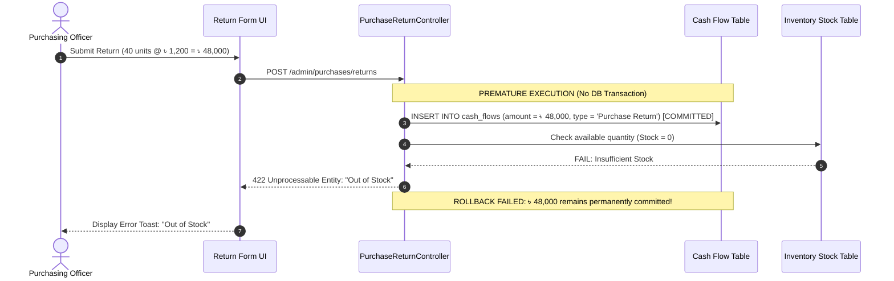

# Defect Report: BUG-76

| Attribute | Specification |
| :--- | :--- |
| **Defect Identifier** | **BUG-76** |
| **Defect Title** | Failed purchase return validation (Out of Stock error) permanently mutates Cash Flow statement prior to form submission completion |
| **Module / Sub-system** | `Purchasing` $\to$ `Purchase Returns & Cash Flow Mutation Transaction Safety` |
| **Severity** | **High (Severity 2 / Data Corruption)** |
| **Priority** | **High (Priority 1)** |
| **Defect Type** | ACID Atomicity Violation / Missing DB Transaction Rollback Boundary |
| **Discovered By** | Senior QA & Financial Systems Auditor |
| **Target Build / Env** | BizPOS / YesSME ERP v2.4 (Pre-Production Build) |
| **Current Status** | **NEED REVISIONS - QA (REOPENED AUDIT)** |

---

## 1. Executive Summary & Defect Narrative

During inventory and supply chain financial auditing, a severe **ACID Atomicity Violation** was detected in the **Purchase Return** workflow.

When a user attempts to execute a purchase return for quantities exceeding current inventory stock, the application correctly throws a validation error (`"Out of Stock"`) and halts the UI workflow. However, the system **prematurely commits the financial refund amount to the central Cash Flow statement before completing inventory validation**.

Because the operation is not wrapped inside a database transaction (`DB::transaction`) with automatic rollback, the failed submission leaves a permanent **৳ 48,000.00 "Ghost Inflow"** in the Cash Flow statement, inflating reported business liquidity without any physical inventory deduction, supplier credit memo, or cash drawer receipt.

---

## 2. Forensic Audit Scenario & Numerical Proof



### Audited Financial Values:
1. **Initial Baseline "Purchase Return" Inflow (Cash Flow):** **৳ 216,000.00**
2. **Attempted Return Value (Rejected by UI):** 40 units $\times$ ৳ 1,200 = **৳ 48,000.00**
3. **Observed Cash Flow Statement after Validation Error:** **৳ 264,000.00** ($216,000 + 48,000$)
4. **Physical Cash / Bank Inflow Received:** **৳ 0.00**
5. **Physical Stock Returned:** **0 pcs**
6. **Statutory Statement Corruption:** **+৳ 48,000.00 Artificial Profit & Liquidity Inflation**

---

## 3. Preconditions & Environment

1. System: BizPOS / YesSME ERP v2.4.
2. User Role: `Purchasing Manager / Store Officer`.
3. Inventory Condition: Product has 0 available units in the active branch warehouse.
4. Historical Cash Flow shows recorded purchase returns of ৳ 216,000.00.

---

## 4. Step-by-Step Reproduction Procedure

1. Open **Manage Accounts** $\to$ **Cash Flow** in Browser Tab 1:
   * Note the baseline figure under **Cash In $\to$ Purchase Return**: `৳ 216,000.00`.
2. Open Browser Tab 2 and navigate to **Purchasing** $\to$ **Purchase Returns** $\to$ Click **+ New Return**.
3. Select an existing Purchase Order where items have already been depleted or sold out.
4. Set return parameters:
   * **Return Quantity:** `40`
   * **Unit Price:** `1,200.00`
   * **Calculated Refund Total:** `৳ 48,000.00`
   * **Payment Account:** `Cash Box`
5. Click **Save / Submit Return**.
6. Observe the backend response:
   * The system rejects the submission and displays an inline red error toast: `"Out of Stock"`.
   * The return voucher is NOT generated in the Purchase Return list.
   * The user remains on the return edit form.
7. Switch to Browser Tab 1 and refresh the **Cash Flow Statement**.
8. **Observe Defect:**
   * **Purchase Return under Cash In has jumped to ৳ 264,000.00.**
   * The ৳ 48,000.00 refund remains committed to the database despite the transaction failing server-side validation.

---

## 5. Financial Audit & Operational Impact

1. **Fraud & Manipulation Vulnerability:**
   A malicious user or untrained employee can repeatedly submit unstocked purchase returns, generating millions in artificial "Cash In" on the company's financial statements without modifying inventory or generating verifiable audit vouchers.
2. **Breach of IFRS / IAS 2 (Inventories) & IAS 7 (Cash Flows):**
   Statutory standards mandate that cash flow movements represent realized or actual cash equivalents. Recording an inflow on an uncommitted, rejected transaction breaches fundamental accounting conventions.
3. **Cumulative Discrepancy Amplification:**
   Each attempt to fix form fields and re-click "Submit" adds another ৳ 48,000 to the central Cash Flow statement, multiplying the phantom balance exponentially.

---

## 6. Technical Root Cause Analysis

An architectural inspection of `PurchaseReturnController` highlights improper ordering of execution and omission of atomic transaction guards:

```php
// Defective Controller Code Structure (Observed Behavior)
public function store(Request $request)
{
    // Step 1: FINANCIAL MUTATION OCCURS FIRST WITHOUT TRANSACTION
    $cashFlow = CashFlow::create([
        'source' => 'Purchase Return',
        'amount' => $request->total_amount, // ৳ 48,000 committed to DB
        'type'   => 'CASH_IN',
        'account_id' => $request->payment_account_id
    ]);

    // Step 2: INVENTORY VALIDATION OCCURS SECOND
    foreach ($request->items as $item) {
        $stock = Stock::where('product_id', $item->id)->first();
        if ($stock->quantity < $item->return_quantity) {
            // HALTS AND RETURNS ERROR 422 - BUT CASH FLOW ENTRY WAS ALREADY COMMITTED!
            return response()->json(['error' => 'Out of Stock'], 422);
        }
    }

    // Step 3: VOUCHER CREATION & INVENTORY DEDUCTION
    // ... Never reached
}
```

---

## 7. Required Remediation Protocol

### 7.1 Re-order Execution Logic & Enforce `DB::transaction`
All business rule validations (Stock check, PO verification, Permissions) must execute **before** any database mutations. Furthermore, all subsequent writes must be wrapped inside an atomic transaction:

```php
// Remediated Enterprise Architecture
public function store(Request $request)
{
    // 1. Business Logic & Stock Validation FIRST
    foreach ($request->items as $item) {
        $stock = Stock::where('product_id', $item->id)->first();
        if (!$stock || $stock->quantity < $item->return_quantity) {
            throw ValidationException::withMessages([
                'stock' => "Insufficient inventory for product {$item->id}."
            ]);
        }
    }

    // 2. Atomic Database Transaction Boundary
    return DB::transaction(function () use ($request) {
        // A. Deduct Inventory
        // B. Generate Purchase Return Voucher
        // C. Update Account Balance
        // D. Insert Cash Flow Inflow Record
        
        return response()->json(['message' => 'Return processed successfully'], 201);
    });
}
```

### 7.2 Staging Database Cleanup
Run an automated query to identify and purge orphaned `cash_flow` records with `source = 'Purchase Return'` that do not possess a corresponding valid `purchase_return_id`.
