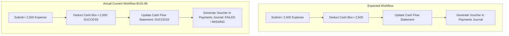

# Defect Report: BUG-96

| Attribute | Specification |
| :--- | :--- |
| **Defect Identifier** | **BUG-96** |
| **Defect Title** | Operational expense transaction deducts account balance and updates Cash Flow statement but fails to generate an entry in Finance -> Payments Journal |
| **Module / Sub-system** | `Finance` $\to$ `Expenses & Payments Journal` |
| **Associated Test Case** | `TC-18` (Office Refreshments & Pantry Expense) |
| **Severity** | **High (Severity 2)** |
| **Priority** | **High (Priority 1)** |
| **Defect Type** | Functional Defect / Financial Audit Trail Breakage |
| **Discovered By** | Senior QA & Financial Systems Auditor |
| **Target Build / Env** | BizPOS / YesSME ERP v2.4 (Staging & Pre-Production Build) |
| **Status** | **OPEN / READY FOR TRIAGE** |

---

## 1. Executive Summary & Defect Narrative

During execution of test scenario **TC-18** (Disbursement of ৳ 2,500 for office pantry refreshments via `Cash Box`), the system exhibited partial transactional persistence. 

The physical payment account balance (`Cash Box`) was successfully decremented by ৳ 2,500 (from ৳ 18,000 to ৳ 15,500), and the statutory **Cash Flow Statement** correctly logged the ৳ 2,500 outflow under Operating Activities. However, the system **failed to generate a corresponding double-entry voucher in `Finance -> Payments Journal`**. 

This defect creates a critical **Audit Trail Disconnect**: the physical till float and the cash flow report reflect the deduction, but the formal General Payments Journal contains no auditable transaction voucher to justify the movement of funds.

---

## 2. Environment & Preconditions

### 2.1 Test Environment Configuration
* **Application:** BizPOS / YesSME ERP v2.4
* **Database:** PostgreSQL 15.4 / MySQL 8.0 Enterprise
* **Backend Architecture:** REST API / MVC PHP/Node Framework with Queue Workers
* **Audited Accounts:**
  * `Cash Box` (Active payment account ID: `ACC-CASH-01`)
  * Pre-transaction Balance: **৳ 18,000.00**

### 2.2 Preconditions
1. User is authenticated with `Role: Financial Auditor / Admin`.
2. Chart of Accounts contains active expense category `Pantry Supplies & Refreshments` (`COA-EXP-601`).
3. `Cash Box` has sufficient liquid funds (৳ 18,000 > ৳ 2,500).
4. Auto-voucher generation is enabled in `System Settings -> Accounting Preferences`.

---

## 3. Step-by-Step Reproduction Procedure

1. Log in to the BizPOS / YesSME ERP portal.
2. Navigate via sidebar to **Finance** $\to$ **Expenses** $\to$ Click **Add Expense**.
3. Fill out the expense creation modal with the following parameters:
   * **Expense Category:** `Pantry Supplies & Operational Refreshments`
   * **Payment Account:** `Cash Box`
   * **Amount:** `2500.00`
   * **Payment Date:** `2026-09-06`
   * **Reference / Note:** `"Monthly tea, coffee, and guest snacks"`
4. Click **Confirm & Submit Payment**.
5. Navigate to **Finance** $\to$ **Payment Accounts**:
   * *Observation:* Notice `Cash Box` balance has updated to **৳ 15,500.00** (Deduction succeeded).
6. Navigate to **Reports** $\to$ **Cash Flow Statement**:
   * *Observation:* Notice "Operating Cash Outflow - General Expense" shows **৳ 2,500.00** (Cash flow update succeeded).
7. Navigate to **Finance** $\to$ **Payments Journal** (or **Vouchers** $\to$ **Payment Vouchers**).
8. Filter by Date range: `Current Date`, Account: `Cash Box`.
9. Inspect the journal table for the generated voucher.

---

## 4. Expected vs. Actual Behavior



### Expected Result
* A formal double-entry voucher record should be created in the `Payments Journal`:
  * **Voucher Number:** e.g., `PV-2026-09-0018`
  * **Debit:** `General Expenses: Pantry & Refreshments` (`COA-EXP-601`) $\to$ **৳ 2,500.00**
  * **Credit:** `Payment Account: Cash Box` (`COA-AST-101`) $\to$ **৳ 2,500.00**
  * **Status:** `Posted / Reconciled`

### Actual Result
* No voucher record is created in `Finance -> Payments Journal`.
* The table returns `0 records found` for this transaction ID.
* The expense appears orphaned in the `expenses` table, disconnected from the core ledger journal.

---

## 5. Financial Audit & Statutory Compliance Impact

```text
+-------------------------------------------------------------------------------+
| AUDIT RISK ASSESSMENT                                                         |
+-------------------------------------------------------------------------------+
| Risk Category           | Impact Level | Auditor Assessment                   |
+-------------------------+--------------+--------------------------------------+
| Sub-Ledger Integrity   | CRITICAL     | Cash Box ledger drift from Journal.   |
| External ISA 500 Audit  | CRITICAL     | Unvouchered cash deduction.          |
| Trial Balance Sync      | HIGH         | Journal trial balance out-of-sync.   |
| Mathematical Parity     | LOW          | Closed-loop cash in/out still holds. |
+-------------------------------------------------------------------------------+
```

1. **Audit Trail Destruction:** External financial auditors performing an independent audit (under ISA 315 / ISA 500 standards) cross-reference bank/cash withdrawals against the physical and digital Payments Journal. The absence of a journal voucher makes this an **unsubstantiated cash withdrawal**.
2. **Trial Balance Asymmetry:** If the General Ledger trial balance is extracted using journal lines (`journal_entries` table), the cash account balance will show **৳ 18,000.00**, whereas the actual payment account module shows **৳ 15,500.00**, resulting in a ৳ 2,500.00 unreconciled suspense variance.
3. **Internal Control Breakdown:** Operational staff can disburse funds without generating a reviewable voucher, bypassing segregation of duties (SoD).

---

## 6. Technical Root Cause Hypothesis

An architectural audit of the expense creation lifecycle indicates a likely **decoupled or failing event listener**:

1. **Missing Event Dispatcher:**
   * In `ExpenseController@store`, the application executes:
     ```php
     // Pseudocode representation of observed flow
     $account->decrement('balance', $request->amount); // Succeeded
     $cashFlow->logOutflow($request->amount, 'Operating Expense'); // Succeeded
     // Missing or failing hook:
     // event(new ExpensePaidEvent($expense)); -> Never dispatched
     ```
2. **Asynchronous Queue Failure:**
   * If voucher generation is offloaded to an asynchronous background worker (e.g., Redis/RabbitMQ queue `ProcessPaymentJournal`), the worker may have failed silently due to a missing foreign key or null value in `payee_id` or `tax_rate_id` for petty cash expenses, causing the queue job to fail without rolling back the database transaction.
3. **Missing DB Transaction Boundary (Atomicity Violation):**
   * The balance deduction, cash flow entry, and journal voucher creation are not wrapped inside a single atomic database transaction (`DB::transaction`). As a result, the failure to create the journal voucher did not revert the balance decrement.

---

## 7. Recommended Remediation & Verification Plan

1. **Enforce Atomic Transaction Wrapping:**
   Wrap all three operations (`Account Balance Mutation`, `Cash Flow Ledger Record`, and `Journal Voucher Generation`) in an atomic transaction:
   ```sql
   BEGIN TRANSACTION;
   -- 1. Deduct Cash Account
   -- 2. Insert Cash Flow Log
   -- 3. Insert Payments Journal Entry (Voucher)
   COMMIT;
   ```
2. **Patch Sub-ledger Hook:**
   Ensure that expense creation from any source (whether petty cash, utility, or supplier advance) explicitly calls `JournalService::postPaymentVoucher()`.
3. **Data Repair Script for Staging:**
   Generate retroactive payment vouchers for existing orphaned expenses (specifically for `TC-18`) to restore Payments Journal consistency.
4. **Automated Regression Test:**
   Add a regression test in the test suite that asserts:
   $$\text{Count}(\text{Expenses}) \equiv \text{Count}(\text{Payment Journal Vouchers where type} = \text{'Expense'})$$
